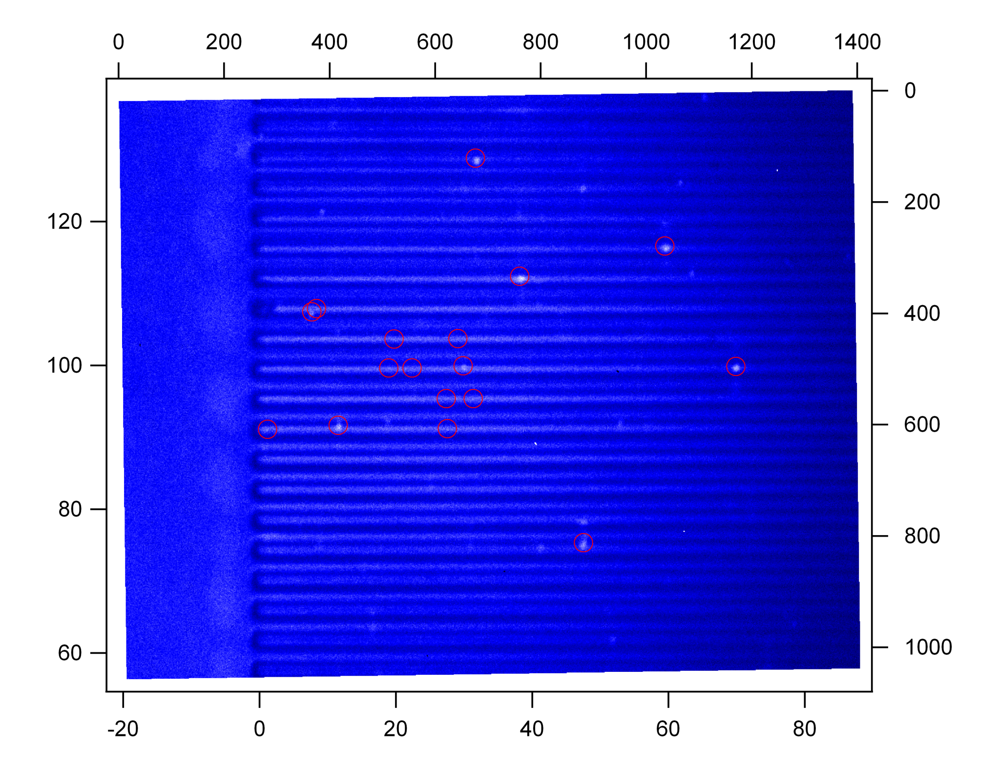
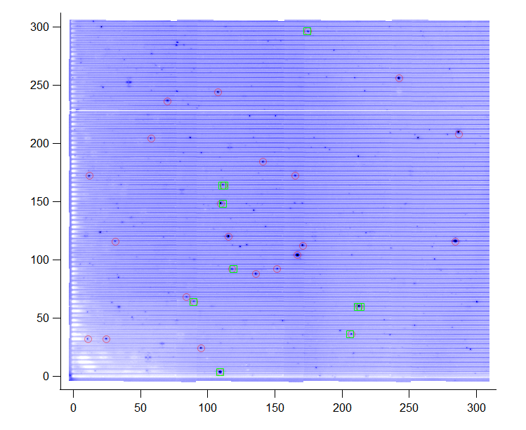
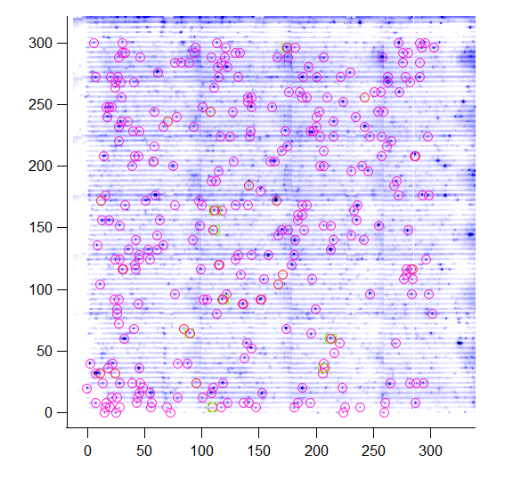

# igor-swnt-massanalysis

A tool for performing statistical actions on top of a collection of spectra

# measurement setup

The camera images and spectra from this program are loaded with
[PLEMd2](https://github.com/ukos-git/igor-swnt-plem) and recorded with a
versatile labview program called
[PLEMv3](https://github.com/ukos-git/labview-plem)

# main functionality

The entry point is `SMAload()` and `SMAadd()`
to define the spectra or images from a
directory that should get loaded. Currently
only `ibw` files are processed using
[PLEM](https://github.com/ukos-git/igor-swnt-plem/).

The files are read from the file system using `SMAread()`. If the data files
are at a specific location in the file system that differs from one machine to
another, you can set the base path using `SMASetBasePath` which allows to
reference all loaded objects relative to this path.

# images

The sample used in this experiment consists of 2µm broad trench structure with
Carbon Nanotubes freely suspended in air over trenches that are engraved on the
substrate. The images are used to obtain the carbon nanotube positions. Carbon
nanotubes from those positions are then used for spectra acquisition.

24 Images are combined to a single image that gives a good overview of the
scanning range that is limited by the nanostage's lateral x and y positioning
range.

The same procedure can be used for different cameras. Here we use a InGaAs
Camera that records more carbon nanotubes but due to its larger pixel size is
not as accurate as the silicon camera above:

From those images, good carbon nanotube positions are picked and a coordinate
list is generated. From each position spectra are recorded:

You can manually add images using `AddCoordinates` or
<kbd>CTRL</kbd>+<kbd>1</kbd>. The zero-position of the image is reset to the
value on cursor A using `SMAtasksZeroToCursor`. You can delete points directly
in the graph by marking them with a Marquee and right-clicking into the area
and select `Erase Points`.

You can generate a scan of 11 points around each coordinate using
`SMAtasksGenerateExactscan`. This is measurement type is referred to a
"exactscan"

# spectra

Simple spectra analysis can be done using

* `SMAgetBestSpectra()`
* `SMAgetMaximum()`

All spectra can be added to a single file using `SMAgetSourceWave`. The
function is aware of mixed x-ranges and can use downsample to reduce
calculation times. You can use <kbd>CTRL</kbd>+<kbd>1</kbd> also in the "source
graph" to select spectra using cursor A. Use `SMAtasksGenerateCoordinates` to
extract the coordinates for the marked spectra.

A symmetric covariance can be calculated from the "source wave" using
`SMAcovariance`. Wigner Transformation is generated using `SMAWigner`.

Mass peak analysis can be performed in a specified x range using
`SMAsinglePeakAction(hcsr(A), hcsr(B))` which is the method of choice if the
peak position is the same for all spectra.

Otherwise use `SMAquickAnalysis` or `SMApeakAnalysis`. If you want to analyse a
measurement of the "exactscan" type, use `SMApeakAnalysisExactscan()` which
finds the best spectrum in a series of 11 spectra around a central location.
